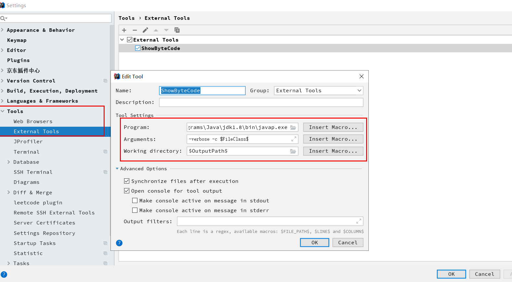

# 插件
## 力扣插件


code file name
```
$!velocityTool.camelCaseName(${question.titleSlug})
```

Code Template
```
${question.content}
  
  package leetcode.editor.en;
  public class $!velocityTool.camelCaseName(${question.titleSlug}){
      public static void main(String[] args) {
           Solution solution = new $!velocityTool.camelCaseName(${question.titleSlug})().new Solution();
      }
      ${question.code}
  }
```
Template Constant
```
${question.title}	题目标题	示例:两数之和
${question.titleSlug}	题目标记	示例:two-sum
${question.frontendQuestionId}	题目编号
${question.content}	题目描述
${question.code}	题目代码
$!velocityTool.camelCaseName(str)	转换字符为驼峰样式
```

## 查看字节码



1. D:\Programs\Java\jdk1.8\bin\javap.exe
2. -verbose -c $FileClass$
